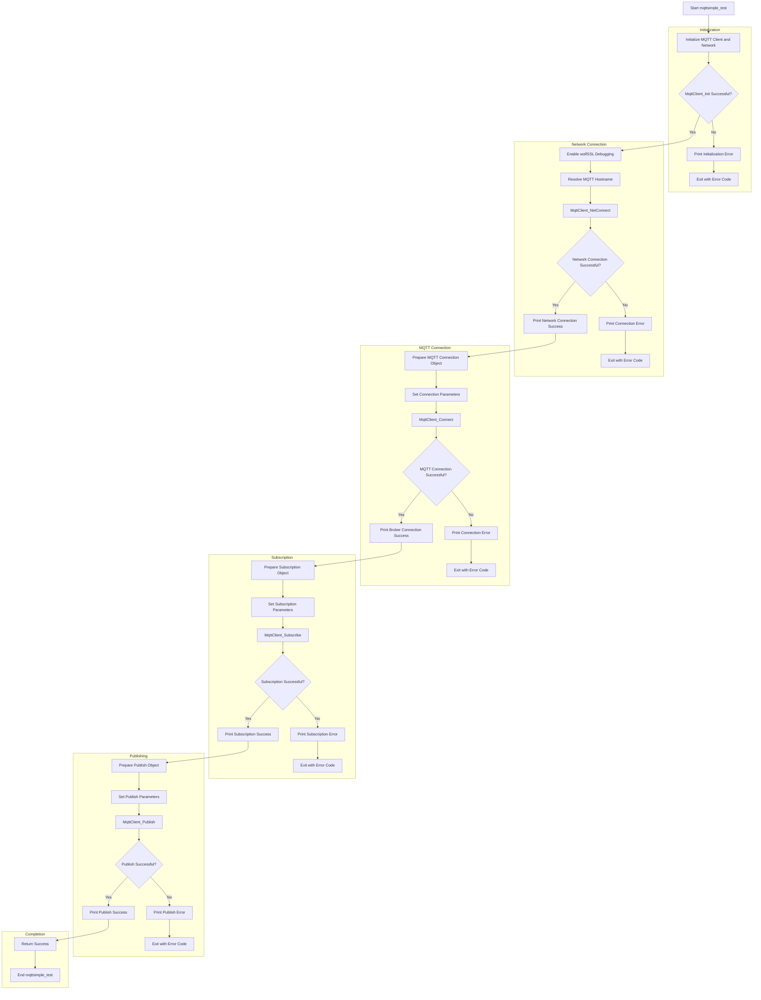

# wolfSSL NXP Application Code Hub

 

## wolfSSL MQTT AWS Test using Zephyr RTOS

This demo demonstrates the capabilities of the new FRDM-MCXN947.

### Demo   
Simply connects to an AWS broker, subscribes, and publishes a message.

*This is currently not a stable demo on the FRDM-MCXN947 Board.*

#### Boards:        FRDM-MCXN947
#### Categories:    RTOS, Zephyr, Networking
#### Peripherals:   UART, ETHERNET
#### Toolchains:    Zephyr

## Table of Contents
1. [Software](#step1)
2. [Hardware](#step2)
3. [Setup](#step3)
4. [Project Options](#step4)
5. [Project Flow Chart](#step5)
6. [FAQs](#step6) 
7. [Support](#step7)
8. [Release Notes](#step8)

## 1. Software
- [MCUXpresso for VS Code 1.5.61 or newer](https://www.nxp.com/products/processors-and-microcontrollers/arm-microcontrollers/general-purpose-mcus/lpc800-arm-cortex-m0-plus-/mcuxpresso-for-visual-studio-code:MCUXPRESSO-VSC?cid=wechat_iot_303216)

- [Zephyr Setup](https://docs.zephyrproject.org/latest/develop/getting_started/index.html)
    - [wolfSSL as a Module added to Zephyr](https://github.com/wolfSSL/wolfssl/blob/master/zephyr/README.md)
    - [Adding the Zephyr Repository (Part 5)](https://community.nxp.com/t5/MCUXpresso-for-VSCode-Knowledge/Training-Walkthrough-of-MCUXpresso-for-VS-Code/ta-p/1634002)

- MCUXpresso Installer:
   - MCUXpresso SDK Developer
   - Zephyr Developer
   - Linkserver

- Ubuntu or MacOS with the following packages:
    - autoconf
    - automake
    - libtool
    - make
    - gcc
    - git 

 - Zephyr:
    - SDK 0.16.8
    - Version 4.0.0

## 2. Hardware
- [FRDM-MCXN947](https://www.nxp.com/products/processors-and-microcontrollers/arm-microcontrollers/general-purpose-mcus/mcx-arm-cortex-m/mcx-n94x-and-n54x-mcus-with-dual-core-arm-cortex-m33-eiq-neutron-npu-and-edgelock-secure-enclave-core-profile:MCX-N94X-N54X)   

- USB Type-C cable
- Ethernet cable
- Networking/Router
- Personal Computer

## 3. Setup

### 3.1 Import the Project and Build
1. Follow section 1: `Setup` in the top-level [README](../README.md).
2. Under the "Projects" tab, right-click the project and choose "Build Selected." This should result in no errors.

    

The project should be called `dm-wolfmqtt-publisher-client-with-zephyr`.

### 3.2 Connect Hardware
1. Connect the FRDM-MCXN947 to your computer with the provided USB-C cable.
2. Connect the FRDM-MCXN947 to your network with an Ethernet cable.

### 3.4 Program and Run the Server
1. Flash the `.elf` file to FRDM-MCXN947. This can be done by right-clicking the project and choosing "Flash the Selected Target."
2. Connect to the serial output of the FRDM-MCXN947 via:
    - Screen Command - `screen /dev/tty"MCXN-Port 115200"`
    - Any serial terminal you are familiar with.
3. Press the reset button on the FRDM-MCXN947 board and view the startup message and MQTT demo.

    

## 4. Project Options
Currently, there are no extra project options.

## 5. Project Flowchart
### Overview

## 6. FAQs
No FAQs have been identified for this project.

## 7. Support

#### Project Metadata
<!----- Boards ----->

<!----- Categories ----->

<!----- Peripherals ----->
 

<!----- Toolchains ----->

Questions regarding the content or correctness of this example can be entered as Issues within this GitHub repository.

>**Warning**: For more general technical questions regarding NXP Microcontrollers and differences in expected functionality, enter your questions on the [NXP Community Forum](https://community.nxp.com/).

## 8. Release Notes
| Version | Description / Update                           | Date                        |
|:-------:|-----------------------------------------------|----------------------------:|
| 1.0     | Initial release on Application Code Hub      | November 17th 2025 |
