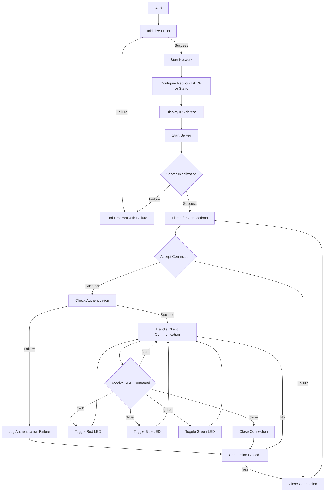

# wolfSSL NXP Application Code Hub

 

## wolfSSH RGB Server using Zephyr RTOS

This demo demonstrates the capabilities of the new FRDM-MCXN947.

### Demo   
Creating a simple server using the Zephyr RTOS and wolfSSL to utilize the networking capabilities of the FRDM-MCXN947 through its Ethernet port.

#### Boards:        FRDM-MCXN947
#### Categories:    RTOS, Zephyr, Networking
#### Peripherals:   UART, ETHERNET
#### Toolchains:    Zephyr

## Table of Contents
1. [Software](#step1)
2. [Hardware](#step2)
3. [Setup](#step3)
4. [Verification](#step4)
5. [Project Options](#step5)
6. [Project Flow Chart](#step6)
7. [FAQs](#step7) 
8. [Support](#step8)
9. [Release Notes](#step9)

## 1. Software
- [MCUXpresso for VS Code 1.5.61 or newer](https://www.nxp.com/products/processors-and-microcontrollers/arm-microcontrollers/general-purpose-mcus/lpc800-arm-cortex-m0-plus-/mcuxpresso-for-visual-studio-code:MCUXPRESSO-VSC?cid=wechat_iot_303216)

- [Zephyr Setup](https://docs.zephyrproject.org/latest/develop/getting_started/index.html)
    - [wolfSSL as a Module added to Zephyr](https://github.com/wolfSSL/wolfssl/blob/master/zephyr/README.md)
    - [wolfSSH as a Module added to Zephyr](https://github.com/wolfSSL/wolfssh/blob/master/zephyr/README.md)
    - [Adding the Zephyr Repository (Part 5)](https://community.nxp.com/t5/MCUXpresso-for-VSCode-Knowledge/Training-Walkthrough-of-MCUXpresso-for-VS-Code/ta-p/1634002)

- MCUXpresso Installer:
   - MCUXpresso SDK Developer
   - Zephyr Developer
   - Linkserver

- Ubuntu or MacOS with the following packages:
    - autoconf
    - automake
    - libtool
    - make
    - gcc
    - git
    - SSH client (wolfSSH, OpenSSH, PuTTY, etc.)

 - Zephyr:
    - SDK 0.16.8
    - Version 4.0.0

- Optional Software:
    - Wireshark

## 2. Hardware
- [FRDM-MCXN947](https://www.nxp.com/products/processors-and-microcontrollers/arm-microcontrollers/general-purpose-mcus/mcx-arm-cortex-m/mcx-n94x-and-n54x-mcus-with-dual-core-arm-cortex-m33-eiq-neutron-npu-and-edgelock-secure-enclave-core-profile:MCX-N94X-N54X)   

- USB Type-C cable
- Ethernet cable
- Networking/Router
- Personal Computer

## 3. Setup

### 3.1 Import the Project and Build
1. Follow section 1: `Setup` in the top-level [README](../README.md).
2. Under the "Projects" tab, right-click the project and choose "Build Selected." This should result in no errors.

    

The project should be called `dm-wolfssh-tls-rgb-server-with-zephyr`.

### 3.2 Connect Hardware
1. Connect the FRDM-MCXN947 to your computer with the provided USB-C cable.
2. Connect the FRDM-MCXN947 to your network with an Ethernet cable.

### 3.4 Program and Run the Server
1. Flash the `.elf` file to FRDM-MCXN947. This can be done by right-clicking the project and choosing "Flash the Selected Target."
2. Connect to the serial output of the FRDM-MCXN947 via:
    - Screen Command - `screen /dev/tty"MCXN-Port 115200"`
    - Any serial terminal you are familiar with.
3. Press the reset button on the FRDM-MCXN947 board and note the IP address displayed.

    

4. Use an SSH client of your choice:
    - **Password Method:**
        - OpenSSH: `ssh zephyr@<noted-ip> -p 11111`
        - This should prompt for a password. Enter `zephyr`.

            - **SSH Client with Password:**
    
                

            - **Serial Terminal with Password:**

                

    - **RSA Key Method:**
        - OpenSSH: `ssh zephyr@<noted-ip> -p 11111 -i /path/to/dm-wolfssh-rgb-server-with-zephyr/Test_Keys/id_rsa_real`
        - Note: You may need to edit the file permissions for these keys via `chmod 600 ./path/to/key`.

            - **SSH Client with Key:**

                

            - **Serial Terminal with Key:**

                

5. Now type in the SSH client `red`, `green`, `blue`, or `close` to either control the corresponding RGB LED, or close the connection to the server.
    - Initially, the RGB will be initialized so that all the LEDs are on, so the RGB light should be white if the device was flashed correctly.

        

    - If you were to enter the following commands in a row:
        - `red` (Will toggle red off)

        

        - `green` (Will toggle green off)

        

        - `blue` (Will toggle blue off)

        

        - `red` (Will toggle red on)

        

        - Then use `close` to end the SSH session

## 4. Verification (optional)
### 4.1 Download and Install Wireshark
- [Wireshark](https://www.wireshark.org/download.html)

### 4.2 Setting up the Wireshark Application
1. Launch the Wireshark application and select the network device you are using for the example.

    

2. Now set up and apply a filter using the noted IP in step: [3.4.3](#step3)

    

3. Now watch the Wireshark capture and redo part 3.4. You can inspect the connection and you can also see what it looks like when the connection is rejected. Try using the fake key provided in `/path/to/dm-wolfssh-rgb-server-with-zephyr/Test_Keys/id_rsa_fake` and inspect the Wireshark capture.

   

## 5. Project Options
### 5.1 Setting up a Static IPv4 on Zephyr
By default, the project is set up to use a DHCP Server. This section will show how to set up a static IP. Please make sure you choose an IP for the device that will not cause an IP conflict on your network.

1. In [src/main.c](src/main.c), look for the following section.

    

2. Set DHCP off for the project by changing

    `#define DHCP_ON 1` 
    
    to

    `#define DHCP_ON 0`

3. Set the `STATIC_IPV4_ADDR` macro to your desired IP. By default, it is set to `192.168.1.70`. Make sure the IP you choose does not cause a conflict on your network.

4. Set the `STATIC_IPV4_GATEWAY` macro to your network's gateway. Usually, this is `192.168.1.1` on home networks, however, this could not always be the case. This is usually the IP of your primary network router.

5. Set the `STATIC_IPV4_NETMASK` macro to your needs. Generally `255.255.255.0` for most use cases.

6. Rebuild the project and flash the device. The IP the device reports back should be the `STATIC_IPV4_ADDR` value you set.

## 6. Project Flowchart
### Overview

## 7. FAQs
No FAQs have been identified for this project.

## 8. Support

#### Project Metadata
<!----- Boards ----->

<!----- Categories ----->

<!----- Peripherals ----->
 

<!----- Toolchains ----->

Questions regarding the content/correctness of this example can be entered as Issues within this GitHub repository.

>**Warning**: For more general technical questions regarding NXP Microcontrollers and the difference in expected functionality, enter your questions on the [NXP Community Forum](https://community.nxp.com/)

## 9. Release Notes
| Version | Description / Update                           | Date                        |
|:-------:|------------------------------------------------|----------------------------:|
| 1.0     | Initial release on Application Code Hub        | November 17th 2025|