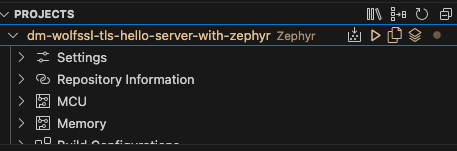
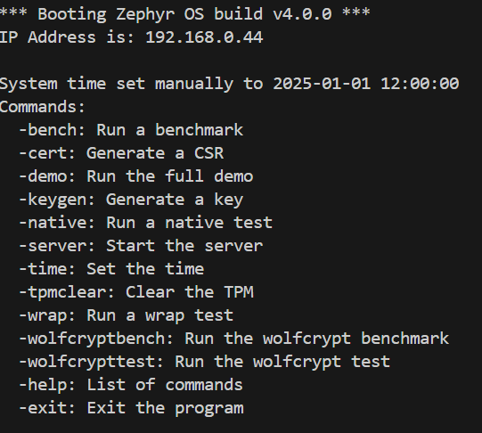

# wolfSSL NXP Application Code Hub

<a href="https://www.nxp.com">  </a> <a href="https://www.wolfssl.com">  </a>

## wolfTPM Interactive Demo with TLS Server using Zephyr RTOS

This demo demonstrates the comprehensive integration of wolfTPM with wolfSSL on the FRDM-MCXN947 platform.

### Demo   
This interactive demo showcases various TPM capabilities using Zephyr RTOS and wolfTPM, as well as a TLSv1.3 server implementation. The application provides an interactive command-line interface to perform TPM operations including key generation, CSR creation, benchmarking, and various TPM tests, along with secure communication capabilities through a TLS server.

**Note**: The MCXN947 does not come with the SD Card slot populated. You will need to solder this onto the Board for the demo to work if you want to use this device.

#### Boards:        FRDM-MCXN947
#### Categories:    RTOS, Zephyr, Security, TPM, Networking
#### Peripherals:   UART, ETHERNET, TPM, SD Card
#### Toolchains:    Zephyr

## Table of Contents
1. [Software](#step1)
2. [Hardware](#step2)
3. [Setup](#step3)
4. [Project Features](#step4)
5. [Project Options](#step5)
6. [FAQs](#step7) 
7. [Support](#step8)
8. [Release Notes](#step9)

## 1. Software<a name="step1"></a>
- [MCUXpresso for VS Code 1.5.61 or newer](https://www.nxp.com/products/processors-and-microcontrollers/arm-microcontrollers/general-purpose-mcus/lpc800-arm-cortex-m0-plus-/mcuxpresso-for-visual-studio-code:MCUXPRESSO-VSC?cid=wechat_iot_303216)

- [Zephyr Setup](https://docs.zephyrproject.org/latest/develop/getting_started/index.html)
    - [wolfSSL as a Module added to Zephyr](https://github.com/wolfSSL/wolfssl/blob/master/zephyr/README.md)
    - [wolfTPM as a Module added to Zephyr](https://github.com/wolfSSL/wolfTPM/blob/master/zephyr/README.md)
    - [Adding the Zephyr Repository (Part 5)](https://community.nxp.com/t5/MCUXpresso-for-VSCode-Knowledge/Training-Walkthrough-of-MCUXpresso-for-VS-Code/ta-p/1634002)

- MCUXpresso Installer:
   - MCUXpresso SDK Developer
   - Zephyr Developer
   - Linkserver

- Ubuntu or MacOS with the following packages:
    - autoconf
    - automake
    - libtool
    - make
    - gcc
    - git

- Zephyr:
    - SDK 0.17.0
    - Version 4.1.0

## 2. Hardware<a name="step2"></a>
- [FRDM-MCXN947.](https://www.nxp.com/products/processors-and-microcontrollers/arm-microcontrollers/general-purpose-mcus/mcx-arm-cortex-m/mcx-n94x-and-n54x-mcus-with-dual-core-arm-cortex-m33-eiq-neutron-npu-and-edgelock-secure-enclave-core-profile:MCX-N94X-N54X)   
[](Images/FRDM-MCXN947-TOP.jpg)
- USB Type-C cable
- Ethernet Cable (Required for TLS server functionality)
- SD Card (Required for key generation and CSR operations)
- Personal Computer
- TPM (SLB9673)
- Networking/Router (for TLS server testing)

## 3. Setup<a name="step3"></a>

### 3.1 Import the Project and Build
1. Follow section 1: `Setup` in the top-level [README](../README.md)
2. Under the "Projects" tab, right-click the project and choose "Build Selected." This should result in no errors. 

[](Images/Setup3-3.png)

The project should be called `dm-wolftpm-wolfssl-tls-with-zephyr`.

### 3.2 SD Card Setup

**Note**: The key files and certificates generated by the demo will be stored on this SD card. If you want to keep these files for future use, make sure to back them up before reformatting or using the card for other purposes.

**Note**: The MCXN947 does not come with the SD Card slot populated. You will need to solder this onto the Board for the demo to work if you want to use this device.

#### 3.2.1 Using the SD Card Setup Script

We provide a convenient script to set up your SD card properly.

**Requirements**
- An SD card (any size is sufficient)
- SD card must be formatted as FAT32 (the script can format it for you if needed)
- The card must be mountable on your Linux system

**Using the Setup Script**

1. Insert your SD card into your computer
2. Run the setup script:
   ```
   ./setup_sdcard.sh
   ```
3. The script will:
   - Show all available disks and partitions on your system
   - Prompt you to enter the correct partition device (e.g., `/dev/sdb1`)
   - Optionally format the card as FAT32 if needed
   - Copy the necessary certificate files to the SD card

#### 3.2.2 Not using the SD Card Setup Script

You will need to format the SD Card to the FAT32 filesystem.

### 3.3 Connect Hardware
1. Plug in your TPM to the corresponding ports on the mikroBus Headers (currently the demo only supports I2C TPMs).

    [](Images/mikroBus-layout.png)

    Using the `Infineon SLB 9673` on a mikroBus breakout board, it will look like this when connected.

    [](Images/FRDM947-SLB9673-Mounted.png)

2. Insert the formatted FAT32 SD card into the appropriate slot
3. Connect the FRDM-MCXN947 to your computer with the provided USB-C Cable
4. Connect an Ethernet cable to your network (required for TLS server functionality)

### 3.4 Program and Run the Demo
1. Flash the `.elf` file to FRDM-MCXN947. This can be done by right-clicking the project and choosing to "Flash the Selected Target."
2. Connect to the serial output of the FRDM-MCXN947 via:
    - Screen Command - `screen /dev/tty"MCXN-Port" 115200`
    - Any serial terminal you are familiar with 
3. Press the reset button on the FRDM-MCXN947 board and view the startup message with available commands.

    [](Images/wolfTPM-ACH-Demo-Start.png)

## 4. Project Features<a name="step4"></a>

### 4.1 Command Options
The demo provides an interactive shell with the following command options:

### `-demo`
**Description:** Run the full TPM demonstration that showcases various TPM capabilities.
- Demonstrates primary TPM functionality in a single command
- Exercises various features of the wolfTPM library
- Provides a comprehensive overview of TPM capabilities

### `-cert`
**Description:** Generate a Certificate Signing Request (CSR) using TPM-protected keys.
- Creates a CSR that can be used for certificate enrollment
- Stores the CSR on the SD card
- Uses TPM-protected private keys for enhanced security
- Requires SD card to be mounted

### `-bench`
**Description:** Run TPM benchmarks to evaluate performance.
**Options:**
- `-aes`: Benchmark AES encryption/decryption operations
- `-xor`: Benchmark XOR operations
- `-h`: Display help for benchmark options
- Custom duration: Specify benchmark duration (1-99999 ms, default: 1000 ms)

### `-wrap`
**Description:** Run TPM key wrapping tests.
- Tests the TPM's ability to wrap (encrypt) and unwrap (decrypt) keys
- Verifies key protection capabilities

### `-native`
**Description:** Run TPM native tests.
- Executes low-level TPM functionality tests
- Verifies core TPM capabilities

### `-keygen`
**Description:** Generate cryptographic keys using the TPM.
**Options:**
- Key types:
  - RSA (default)
  - ECC
  - Symmetric
- Output file: Specify location on SD card (default: /SD:/keyblob.bin)
- Template options: Use default template or AIK template
- Parameter encryption:
  - AES
  - XOR
  - None (default)
- Additional options:
  - `-eh`: Use endorsement hierarchy
  - `-pem`: Output in PEM format
- Requires SD card to be mounted

### `-tpmclear`
**Description:** Clear the TPM.
- Resets the TPM to factory state
- Removes all keys and data stored in the TPM
- Use with caution as this operation cannot be undone
- Use when having issues with the TPM Demo such as: 
    - `TPM_RC_SESSION_MEMORY` which indicates the TPM has run out of memory for storing active sessions.
- When used, you will want to regenerate keys and certs as well

### `-server`
**Description:** Start a TLSv1.3 server that uses TPM for cryptographic operations.
**Options:**
- Key types:
  - RSA (default)
  - ECC
- Parameter encryption options
- Server loop options
- Self-signed certificate generation
- Custom port configuration

### `-time`
**Description:** Set the system time manually.
- Allows setting date and time when NTP is not available
- Essential for certificate operations that require accurate timestamps

### `-wolfcrypttest`
**Description:** Run the wolfCrypt cryptographic library tests.
- Tests cryptographic algorithms implemented in wolfCrypt
- Verifies proper operation of cryptographic functions

### `-wolfcryptbench`
**Description:** Run the wolfCrypt cryptographic benchmarks.
- Benchmarks performance of various cryptographic algorithms
- Provides metrics on encryption/decryption speeds

### `-exit`
**Description:** Exit the program.

### `-help`
**Description:** Display a list of available commands.

### 4.2 Manual Demonstration Workflow
While the `-demo` command provides a quick way to run through all the TPM features, you can also perform these operations manually step by step for more control over the process. This section outlines how to replicate the demo functionality using individual commands.

#### Step 1: Generate Keys with `-keygen`
First, generate the cryptographic keys that will be used for TLS communications:

1. Run the `-keygen` command
2. When prompted, select RSA key type (option 1)
3. Specify output file (e.g., "/SD:/rsa.raw")
4. Choose "y" for default template
5. Select "1" for AES parameter encryption
6. For additional options, enter "-pem" to output in PEM format

This will generate an RSA key protected by the TPM with AES parameter encryption and saved in PEM format.

#### Step 2: Create a Certificate with `-cert`
Next, create a certificate signing request (CSR) using the key you just generated:

1. Run the `-cert` command
2. The command will automatically use the TPM-protected key to generate a CSR
3. The CSR will be saved to the SD card
4. Copy the generated RSA Cert and place it into a file on your local computer

This step creates a certificate that can be used by the TLS server for authentication.

#### Step 3: Start the TLS Server with `-server`
Finally, start the TLS server using the key and certificate:

1. Run the `-server` command
2. Select RSA key type (option 1)
3. Choose "1" for AES parameter encryption
4. Choose "y" to generate a self-signed certificate
5. Run in loop mode? (y/n, default: n): n - Will keep device running the basic server if y is selected
6. Leave port option empty to use the default port (11111)

The server will start and listen for incoming connections. You can connect to it using a TLS client as described in section 4.3.

By following these three steps manually, you have complete control over each part of the process that the `-demo` command automates.

### 4.3 Communication with the server

1. `cd __repo__/modules/crypto/wolfssl`
2. `./autogen.sh`
3. `./configure`
4. `make`
5. cp the noted cert generated by the device to the `wolfssl` directory and make sure its saved as `<name>.pem`. Name is your choice.
6. Make sure the server is running on zephyr via the `-server` or `-demo` command
7. Connect with the client
    ```
    ./example/client/client -h <ip of zephyr device as displayed at boot> -A <path/to/cert.pem/you/saved> -w
    ```


## 5. Project Options<a name="step5"></a>
### 5.1 Setting up a static IPv4 on Zephyr
By default the project is set up to use a DHCP Server, this section will show how to set up a static IP. Please make sure you choose an IP for the device that will not cause an IP conflict on your network.

1. In [src/main.c](src/main.c), look for the following section.

    [](Images/ProjectOptions5-1-1.png)

2. Set DHCP off for the project by changing

    `#define DHCP_ON 1` 
    
    to

    `#define DHCP_ON 0`

3. Set the `STATIC_IPV4_ADDR` macro to your desired IP, by default it is set to `192.168.1.70`. Make sure the IP you choose does not cause a conflict on your network.

4. Set the `STATIC_IPV4_GATEWAY` macro to your network's gateway. Usually this is `192.168.1.1` on home networks, however this could not always be the case. This is usually the IP of your primary network router.

5. Set the `STATIC_IPV4_NETMASK` macro to your needs. Generally `255.255.255.0` for most use cases.

6. Set the `NO_INTERNET` macro to `0` to enable NTP and DNS resolution. This will setup the device to use the NTP server `pool.ntp.org` and DNS server `8.8.8.8` to get the current date and time.

7. Set the `NO_INTERNET` macro to `1` to disable NTP and DNS resolution. This will setup the device to use the date and time manually set in the `set_time_manually` function. Time is set to 1st January 2025 12:00:00 by default.

8. Rebuild the project and flash the device.

## 6. FAQs<a name="step7"></a>
1. **Q: Why is my SD card not recognized?**
   A: Ensure your SD card is properly formatted (FAT32) and correctly inserted.

2. **Q: What happens if I run -tpmclear?**
   A: This will clear all data in the TPM, including any generated keys.

3. **Q: Can I use the TLS server and TPM features together?**
   A: Yes, the TLS server can leverage TPM capabilities for enhanced security.

4. **Q: Why can't clients connect to my TLS server?**
   A: Check your network settings, firewall rules, and ensure the client is using the correct IP address, port, and TLS version.

## 7. Support<a name="step8"></a>

#### Project Metadata
<!----- Boards ----->
[](https://github.com/search?q=org%3Anxp-appcodehub+FRDM-MCXN947+in%3Areadme&type=Repositories)

<!----- Categories ----->
[](https://github.com/search?q=org%3Anxp-appcodehub+security+in%3Areadme&type=Repositories)
[](https://github.com/search?q=org%3Anxp-appcodehub+rtos+in%3Areadme&type=Repositories)
[](https://github.com/search?q=org%3Anxp-appcodehub+networking+in%3Areadme&type=Repositories)

<!----- Peripherals ----->
[](https://github.com/search?q=org%3Anxp-appcodehub+uart+in%3Areadme&type=Repositories) [](https://github.com/search?q=org%3Anxp-appcodehub+ethernet+in%3Areadme&type=Repositories) [](https://github.com/search?q=org%3Anxp-appcodehub+tpm+in%3Areadme&type=Repositories)

<!----- Toolchains ----->
[](https://github.com/search?q=org%3Anxp-appcodehub+vscode+in%3Areadme&type=Repositories)

Questions regarding the content/correctness of this example can be entered as Issues within this GitHub repository.

>**Warning**: For more general technical questions regarding NXP Microcontrollers and the difference in expected functionality, enter your questions on the [NXP Community Forum](https://community.nxp.com/)

## 8. Release Notes<a name="step9"></a>
| Version | Description / Update                           | Date                        |
|:-------:|------------------------------------------------|----------------------------:|
| 1.0     | Initial release on Application Code Hub        | November 17th 2025|